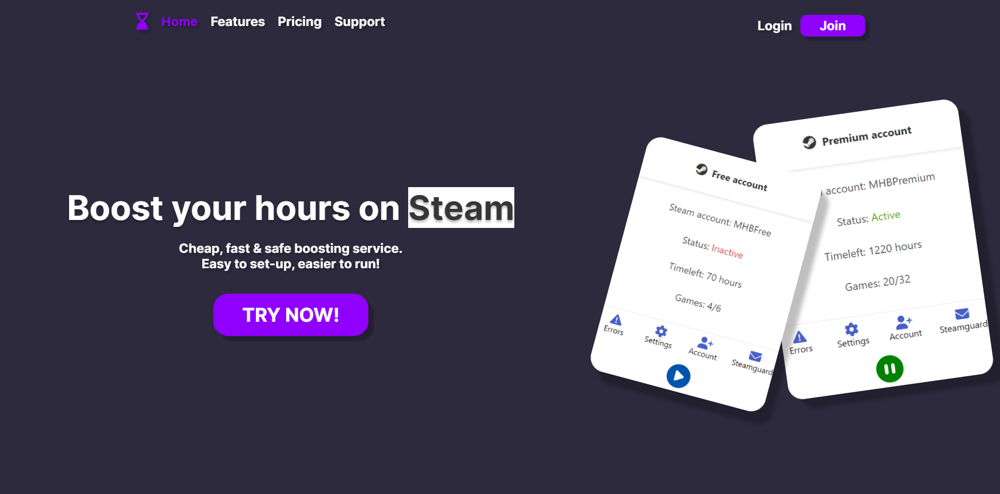

# Steam Web Idler V2

Enhanced Web App for boosing hours on steam (idler). This can be ran as a paid service.
For more, please contact me.


## Requirements

- Node.JS (Latest).
- MySQL Database.

## Installation

1. Download or clone the repository.

2. Install packages:
```bash
  npm install
```
3. Create a new MySQL database.
4. Add the following tables to the database created:
(Database for website accounts)
```bash
  CREATE TABLE IF NOT EXISTS accounts (
    id INT(6) UNSIGNED AUTO_INCREMENT PRIMARY KEY,
    username VARCHAR(30) NOT NULL,
    password VARCHAR(100) NOT NULL,
    email VARCHAR(50) NOT NULL,
	  plan VARCHAR(30) DEFAULT 'Free',
    timeleft_free INT(100) DEFAULT '6000',
    timeleft_premium int(100) DEFAULT '0',
    reg_date TIMESTAMP DEFAULT CURRENT_TIMESTAMP ON UPDATE CURRENT_TIMESTAMP
)
```
(Database for steam accounts)
```bash
CREATE TABLE IF NOT EXISTS steamaccounts_free (
    id INT(6) UNSIGNED AUTO_INCREMENT PRIMARY KEY,
    username VARCHAR(30) NOT NULL,
    steamUsernameFree VARCHAR(30) NOT NULL,
    steamPasswordFree VARCHAR(100) NOT NULL,
    statusFree VARCHAR(30) DEFAULT 'Inactive'
)
```
```bash
CREATE TABLE IF NOT EXISTS steamaccounts_premium (
    id INT(6) UNSIGNED AUTO_INCREMENT PRIMARY KEY,
    username VARCHAR(30) NOT NULL,
    steamUsernamePremium VARCHAR(30) NOT NULL,
    steamPasswordPremium VARCHAR(100) NOT NULL,
    statusPremium VARCHAR(30) DEFAULT 'Inactive'
)
```
```bash
Tables for settings will be added later, since I have to redo them.
```
5. Start the server using the command below:
```bash
  npm start
```
## Authentication

Website authentication is fully encrypted using [bcrypt](https://www.npmjs.com/package/bcrypt).

Steam account encryptions are made using [crypto](https://nodejs.org/api/crypto.html), 
using aes-256-cbc algorithm. To customize this encryption, change:

```bash
const algorithm = "aes-256-cbc";
const initVectorString = "1234567890zxcvbn";
const SecuritykeyString = "1234567890zxcvbn1234567890zxcvbn";
```
in ```routers/index.js``` file.

You can change the algorithm type. More informations [here](https://nodejs.org/en/knowledge/cryptography/how-to-use-crypto-module/).

## How does it work?

1. Create website account.
Based on website plan, you'll be able to add STEAM accounts
 - free => 1 limited steam accounts; 
 - premium => 2 steam accounts (1 will be limited by default);

2. Add steam account; steam account(s) will be added to database, and the password will be encrypted using encrypt function.

3. Customize settings (working on it)

4. Start the idler; it's decrypting the password in order to connect to steam, and store the running account to a list.

5. Stop the idler; automatically get's the name of your steam account, and search in the running accounts list. If it's found, it will stop the idling, if it's not found, then nothing will be stopped (since the account is not running)

### Note
In order to see the app page, you need a plan (```Free```, ```Premium```, ```Admin```).

Free plan:
- ```Can only idle one account, limited to 3 games (customizable), limited to settings.```

Premium plan: 
- ```Can idle 2 accounts at the same time. One will be limited to settings (with lower restricts) and one account will have no settings limits.```

Admin plan:
- ``` Basically premium plan, but it has access to an admin dashboard (You will be able to create cupons, see how many people are idling and more, soon)```

# What's new? 

This new version, comes with:
- New UI (still working on improvements).
- Better optimization.
- Recoded almost entirely.
- Constant updates.

# TO DO
- Add support page - (will be added later, isn't a priority)
- Optimize the code (make it lightweight) - (phase 1 done, still working on some optimizations)
- Create a complex control panel for admins - (will be added later, isn't a priority)
- Add settings page to users (change pw, emails etc) - (will be added later, isn't a priority)
- Add steam settings - Title, Auto responder etc - (added, still working on improvements)
- Add email confirmation - (will be added later, isn't a priority)

# Screenshots


more will be added later.